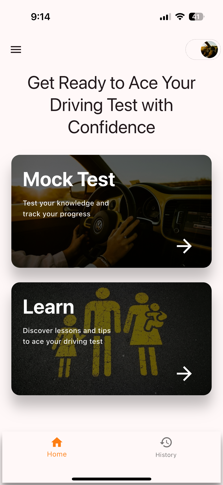
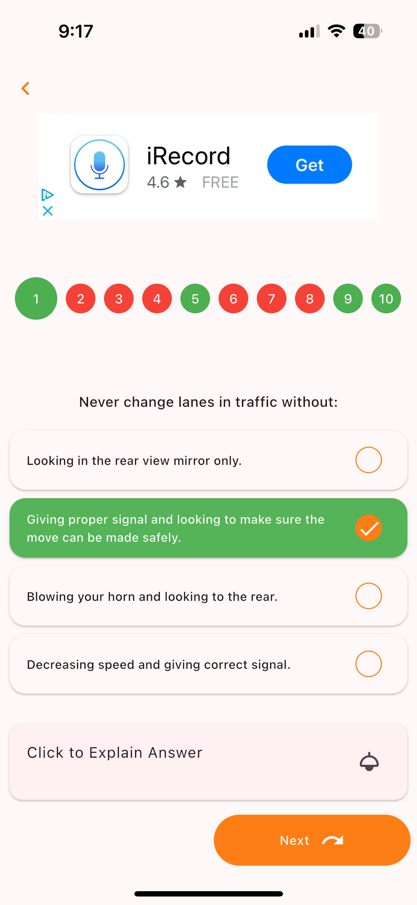
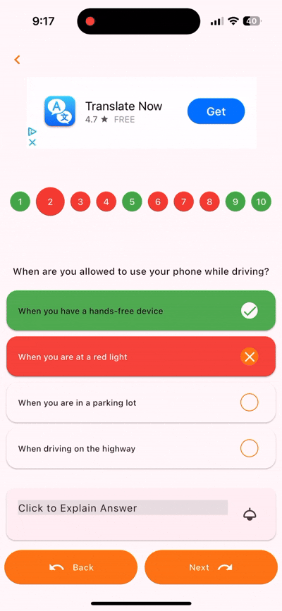

# Ontario G1 test app

## Overview
The G1 Test Prep App helps users pass the Ontario G1 driving test. It includes practice questions, AI explanations, and progress tracking. Available on iOS, Android, and tablets.

## Features
- **Extensive Question Bank** – Realistic test questions.
- **AI-Powered Explanations** – Understand mistakes with Gemini AI.
- **Progress Tracking** – Identify weak areas.
- **Offline Mode** – Study anywhere.
- **User-Friendly UI** – Smooth learning experience.

## Screenshots  

| Home Screen | Question Screen | AI Explanation |  
|------------|----------------|----------------|  
|  |  |  |  

## Download
[App Store](https://apps.apple.com/us/app/ontario-g1-test-2024/id6648798401) | [Google Play](https://play.google.com/store/apps/details?id=com.itsourlives.dri_learn)
## Deployment

Uses **Fastlane** for automated app releases to Google Play and Apple App Store.

## Technology Stack
- Flutter
- Gemini AI
- Firebase
- Fastlane

## Future Enhancements
- Dark mode support
- AI interactions

## Contributing
Open a pull request or submit an issue.

## License
MIT License.
